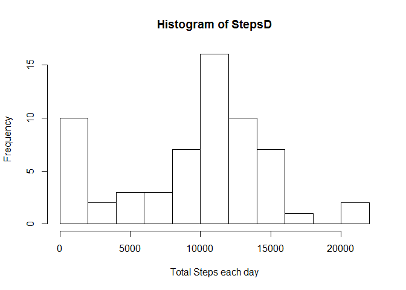
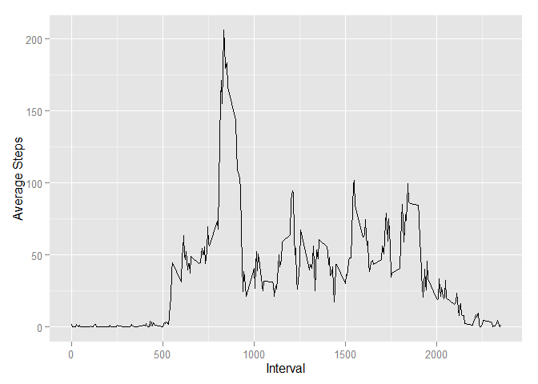
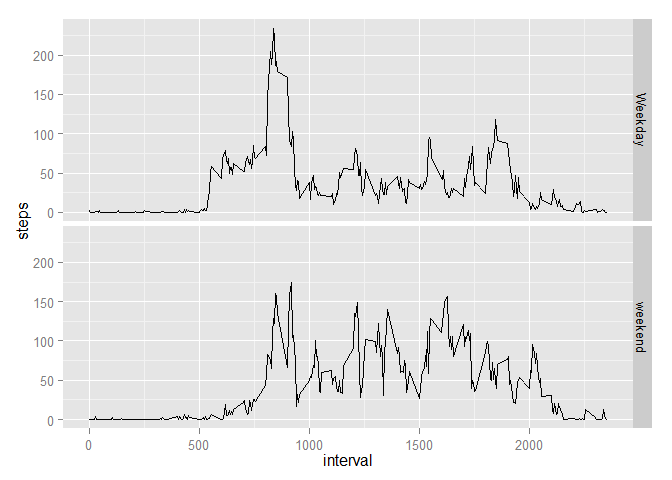

# Reproducible Research: Peer Assessment 1


## Loading and preprocessing the data

```r
unzip("activity.zip")
ActiveM <- read.csv("activity.csv")
```

## What is mean total number of steps taken per day?

```r
StepsD <- tapply(ActiveM$steps, ActiveM$date, FUN = sum, na.rm = TRUE)
hist(StepsD, breaks=10, xlab = "Total Steps each day")
```

 

```r
StepsT<- aggregate(steps ~ date, data = ActiveM, FUN = sum)
mean(StepsT$steps)
```

```
## [1] 10766.19
```

```r
median(StepsT$steps)
```

```
## [1] 10765
```


## What is the average daily activity pattern?

```r
library(ggplot2)

AvgDailyAct <- aggregate(steps ~ interval, data = ActiveM, FUN = mean)
ggplot(data = AvgDailyAct, aes(x = interval, y = steps)) + geom_line() + 
              xlab("Interval") + ylab("Average Steps")
```

 

```r
AvgDailyAct[which.max(AvgDailyAct$steps),]
```

```
##     interval    steps
## 104      835 206.1698
```

## Imputing missing values

```r
TotalMiss <- sum(is.na(ActiveM$steps))
TotalMiss
```

```
## [1] 2304
```

```r
mean(StepsT$steps, na.rm = TRUE)
```

```
## [1] 10766.19
```

```r
median(StepsT$steps, na.rm = TRUE)
```

```
## [1] 10765
```
## Are there differences in activity patterns between weekdays and weekends?

```r
ExtractDay <- function(date) {
  if (weekdays(date) %in% c("Monday", "Tuesday", "Wednesday", "Thursday", "Friday")) 
    return("Weekday") else if (weekdays(date) %in% c("Saturday", "Sunday")) 
      return("weekend") 
}

ActiveM$date <- as.Date(ActiveM$date)
ActiveM$day <- sapply(ActiveM$date, FUN = ExtractDay)

AvgP <- aggregate(steps ~ interval + day, data = ActiveM, mean)
ggplot(AvgP, aes(interval, steps)) + geom_line() + facet_grid(day ~ .) + 
    xlab("interval") + ylab(" steps")
```

 
